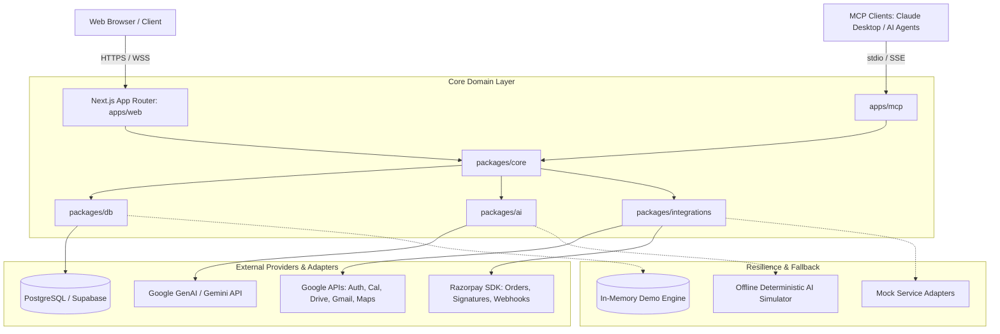

# CampusOS System Architecture

## 1. Architectural Overview
CampusOS is designed as a modular, event-capable, multi-tenant campus operating system. It operates on a clean separation of concerns between presentation, domain logic, persistence, external API adapters, and AI orchestration.



---

## 2. Monorepo Structure

```
CampusOS/
├── apps/
│   ├── web/                    # Next.js 15+ App Router application
│   │   ├── app/                # App router routes (API, dashboards, auth)
│   │   ├── components/         # Page and UI layout components
│   │   └── lib/                # Web-specific utilities and session hooks
│   └── mcp/                    # MCP server implementation
│       ├── src/
│       │   ├── tools/          # Tool definitions conforming to MCP standard
│       │   ├── server.ts       # Server initialization (stdio / SSE)
│       │   └── index.ts
├── packages/
│   ├── core/                   # Pure domain models, validation, business rules
│   │   ├── src/
│   │   │   ├── rbac/           # Role-Based Access Control policies
│   │   │   ├── schema/         # Zod schemas for all domain entities
│   │   │   └── types/          # Domain TypeScript interfaces
│   ├── db/                     # Data access layer
│   │   ├── src/
│   │   │   ├── client.ts       # Supabase client factory
│   │   │   ├── repository/     # Data repositories with Demo Mode fallback
│   │   │   └── seeds/          # Seed data generator for offline demo mode
│   │   └── migrations/         # PostgreSQL schema migration scripts
│   ├── integrations/           # External API service adapters
│   │   ├── src/
│   │   │   ├── google/         # Calendar, Drive, Gmail, Maps adapters
│   │   │   ├── razorpay/       # Order creation, verification, webhooks
│   │   │   └── mock/           # Mock service implementations
│   ├── ai/                     # AI abstraction layer
│   │   ├── src/
│   │   │   ├── client.ts       # Provider agnostic AI client interface
│   │   │   ├── gemini.ts       # Google GenAI implementation
│   │   │   ├── guardrails.ts   # Prompt injection & confirmation safety
│   │   │   └── tools.ts        # Structured function calling tools
│   ├── ui/                     # Shared UI library
│   │   └── src/
│   │       ├── components/     # shadcn / Radix primitives
│   │       ├── styles/         # Global styles & Tailwind config
│   │       └── utils.ts
│   └── config/                 # Shared dev configuration
│       ├── eslint/
│       └── tsconfig/
```

---

## 3. Core Modules & Responsibilities

| Module | Scope & Functionality | Access Roles |
| :--- | :--- | :--- |
| **Dashboard** | Unified metrics, daily schedule, upcoming events, academic alerts, quick action shortcuts. | Student, Organizer, Admin |
| **Events** | Public event feed, multi-tier ticket sales, RSVP processing, attendee badge generator, organizer event creator. | All (Public browse, Student RSVP, Organizer Create) |
| **Clubs** | Campus clubs directory, committee rosters, membership applications, meeting coordination. | All (Admin approvals) |
| **Tasks** | Personal and organization task boards, priorities, due dates, course linkages. | Student, Organizer |
| **Timetable** | Weekly schedule matrix, room numbers, faculty tags, class time reminders. | Student, Faculty |
| **Attendance** | Check-in simulation, QR scanner emulator, attendance percentage tracking, shortfall alerts. | Student (view/check-in), Organizer/Faculty (manage) |
| **Resources** | Lab spaces, auditoriums, sports facilities, AV equipment booking and conflict prevention. | Student, Organizer (Admin approvals) |
| **Calendar** | Unified monthly/weekly view combining academic timetable, club events, and Google Calendar sync. | All |
| **Payments** | Razorpay checkout integration, order generation, signature verification, receipts, refund management. | Student (pay), Organizer (view income), Admin |
| **Notifications**| In-app notification bell, status toasts, system announcements, transactional email logs. | All |
| **AI Assistant**| Conversational campus assistant, study plan generation, event drafting, policy queries with human-in-the-loop tool execution. | All |
| **Integrations** | Connection center for Google OAuth, Gemini, Razorpay, MCP; live connectivity health indicators. | Organizer, Admin |
| **Admin** | User administration, organization review, role escalation, tenant configuration. | Admin |
| **Audit Logs** | Immutable system event log capturing actor, action, target entity, timestamp, IP, diff. | Admin |

---

## 4. Design Principles & UI/UX Standards
- **Command-Center Aesthetic**: Compact, high-density layouts optimized for productivity without visual clutter.
- **Theme Support**: Seamless Dark and Light theme switching utilizing CSS variables and Tailwind color tokens.
- **WCAG-Conscious Contrast**: All text and interactive states adhere to WCAG 2.1 AA/AAA contrast ratios.
- **Zero-Flicker States**: Skeletons and optimistic UI updates for real-time interactions.
- **Human-In-The-Loop AI**: Read-only queries resolve instantly; any action that alters state (creating calendar events, reserving spaces, spending money) produces an explicit interactive confirmation card.

---

## 5. Demo Mode Architecture
CampusOS provides **100% operational functionality in Demo Mode** without requiring live API keys or cloud credentials:
- If `NEXT_PUBLIC_SUPABASE_URL` or database credentials are not configured, the database repositories seamlessly route to an in-memory reactive mock store initialized from `packages/db/src/seeds/demo-data.json`.
- If `GOOGLE_CLIENT_ID` or Google OAuth tokens are missing, Google API calls gracefully route to the Google Mock Service Adapter, simulating calendar events, drive file creation, and email receipts.
- If `RAZORPAY_KEY_ID` is not supplied, checkout opens an interactive demo payment simulator allowing instant simulation of successful payments, failures, or cancellations.
- A prominent status banner indicates **Demo Mode Active** with one-click toggles and diagnostics at `/api/health`.
