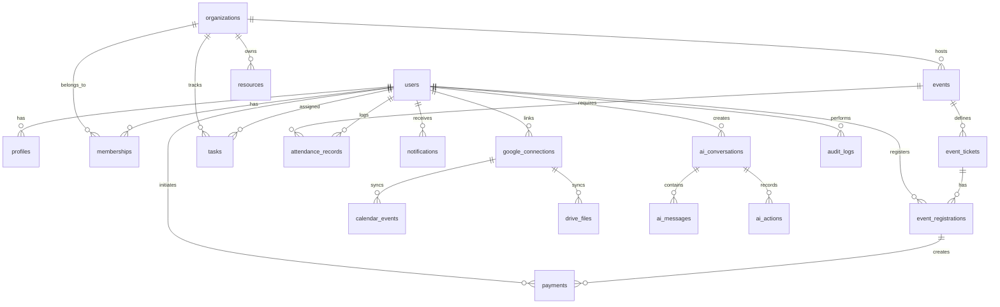

# CampusOS Database Design & Relational Schema

## 1. Relational Schema Overview
CampusOS uses a normalized PostgreSQL relational database with multi-tenant organization boundaries, row-level security (RLS) considerations, referential integrity via foreign keys, cascading rules, explicit check constraints, and indexed lookups.



---

## 2. Table Specifications & Migration DDL

### 2.1 Core Identity & Organization

```sql
-- Enums
CREATE TYPE user_role AS ENUM ('STUDENT', 'ORGANIZER', 'ADMIN');
CREATE TYPE membership_role AS ENUM ('MEMBER', 'OFFICER', 'LEAD');
CREATE TYPE event_status AS ENUM ('DRAFT', 'PUBLISHED', 'COMPLETED', 'CANCELLED');
CREATE TYPE registration_status AS ENUM ('PENDING', 'CONFIRMED', 'WAITLISTED', 'CANCELLED');
CREATE TYPE payment_status AS ENUM ('CREATED', 'AUTHORIZED', 'CAPTURED', 'FAILED', 'REFUNDED');
CREATE TYPE task_priority AS ENUM ('LOW', 'MEDIUM', 'HIGH', 'URGENT');
CREATE TYPE task_status AS ENUM ('TODO', 'IN_PROGRESS', 'REVIEW', 'DONE');

-- 1. users
CREATE TABLE users (
    id UUID PRIMARY KEY DEFAULT gen_random_uuid(),
    email VARCHAR(255) UNIQUE NOT NULL,
    encrypted_password VARCHAR(255),
    role user_role NOT NULL DEFAULT 'STUDENT',
    is_active BOOLEAN NOT NULL DEFAULT TRUE,
    created_at TIMESTAMPTZ NOT NULL DEFAULT NOW(),
    updated_at TIMESTAMPTZ NOT NULL DEFAULT NOW()
);

-- 2. profiles
CREATE TABLE profiles (
    id UUID PRIMARY KEY DEFAULT gen_random_uuid(),
    user_id UUID UNIQUE NOT NULL REFERENCES users(id) ON DELETE CASCADE,
    full_name VARCHAR(150) NOT NULL,
    avatar_url TEXT,
    student_id VARCHAR(50),
    department VARCHAR(100),
    year_of_study INT,
    phone VARCHAR(30),
    bio TEXT,
    created_at TIMESTAMPTZ NOT NULL DEFAULT NOW(),
    updated_at TIMESTAMPTZ NOT NULL DEFAULT NOW()
);
CREATE INDEX idx_profiles_user_id ON profiles(user_id);
CREATE INDEX idx_profiles_student_id ON profiles(student_id);

-- 3. organizations (Clubs, Societies, Departments)
CREATE TABLE organizations (
    id UUID PRIMARY KEY DEFAULT gen_random_uuid(),
    name VARCHAR(200) NOT NULL,
    slug VARCHAR(200) UNIQUE NOT NULL,
    description TEXT,
    logo_url TEXT,
    banner_url TEXT,
    category VARCHAR(100),
    is_verified BOOLEAN NOT NULL DEFAULT FALSE,
    created_by UUID REFERENCES users(id) ON DELETE SET NULL,
    created_at TIMESTAMPTZ NOT NULL DEFAULT NOW(),
    updated_at TIMESTAMPTZ NOT NULL DEFAULT NOW()
);
CREATE INDEX idx_organizations_slug ON organizations(slug);

-- 4. memberships
CREATE TABLE memberships (
    id UUID PRIMARY KEY DEFAULT gen_random_uuid(),
    organization_id UUID NOT NULL REFERENCES organizations(id) ON DELETE CASCADE,
    user_id UUID NOT NULL REFERENCES users(id) ON DELETE CASCADE,
    role membership_role NOT NULL DEFAULT 'MEMBER',
    joined_at TIMESTAMPTZ NOT NULL DEFAULT NOW(),
    UNIQUE (organization_id, user_id)
);
CREATE INDEX idx_memberships_org_user ON memberships(organization_id, user_id);
```

### 2.2 Events, Tickets & Registrations

```sql
-- 5. events
CREATE TABLE events (
    id UUID PRIMARY KEY DEFAULT gen_random_uuid(),
    organization_id UUID REFERENCES organizations(id) ON DELETE SET NULL,
    title VARCHAR(255) NOT NULL,
    slug VARCHAR(255) UNIQUE NOT NULL,
    description TEXT,
    venue VARCHAR(255) NOT NULL,
    latitude DOUBLE PRECISION,
    longitude DOUBLE PRECISION,
    start_time TIMESTAMPTZ NOT NULL,
    end_time TIMESTAMPTZ NOT NULL,
    status event_status NOT NULL DEFAULT 'DRAFT',
    banner_url TEXT,
    max_capacity INT NOT NULL DEFAULT 100,
    is_paid BOOLEAN NOT NULL DEFAULT FALSE,
    created_by UUID REFERENCES users(id) ON DELETE SET NULL,
    created_at TIMESTAMPTZ NOT NULL DEFAULT NOW(),
    updated_at TIMESTAMPTZ NOT NULL DEFAULT NOW()
);
CREATE INDEX idx_events_start_time ON events(start_time);
CREATE INDEX idx_events_org_id ON events(organization_id);

-- 6. event_tickets
CREATE TABLE event_tickets (
    id UUID PRIMARY KEY DEFAULT gen_random_uuid(),
    event_id UUID NOT NULL REFERENCES events(id) ON DELETE CASCADE,
    title VARCHAR(100) NOT NULL,
    description TEXT,
    price_cents INT NOT NULL DEFAULT 0,
    currency VARCHAR(10) NOT NULL DEFAULT 'INR',
    quantity_available INT NOT NULL DEFAULT 100,
    quantity_sold INT NOT NULL DEFAULT 0,
    sales_start TIMESTAMPTZ NOT NULL DEFAULT NOW(),
    sales_end TIMESTAMPTZ NOT NULL,
    created_at TIMESTAMPTZ NOT NULL DEFAULT NOW()
);
CREATE INDEX idx_tickets_event_id ON event_tickets(event_id);

-- 7. event_registrations
CREATE TABLE event_registrations (
    id UUID PRIMARY KEY DEFAULT gen_random_uuid(),
    event_id UUID NOT NULL REFERENCES events(id) ON DELETE CASCADE,
    ticket_id UUID NOT NULL REFERENCES event_tickets(id) ON DELETE RESTRICT,
    user_id UUID NOT NULL REFERENCES users(id) ON DELETE CASCADE,
    registration_number VARCHAR(64) UNIQUE NOT NULL,
    status registration_status NOT NULL DEFAULT 'CONFIRMED',
    check_in_time TIMESTAMPTZ,
    created_at TIMESTAMPTZ NOT NULL DEFAULT NOW(),
    updated_at TIMESTAMPTZ NOT NULL DEFAULT NOW(),
    UNIQUE(event_id, user_id)
);
CREATE INDEX idx_reg_event_user ON event_registrations(event_id, user_id);
```

### 2.3 Payments & Transactions

```sql
-- 8. payments
CREATE TABLE payments (
    id UUID PRIMARY KEY DEFAULT gen_random_uuid(),
    user_id UUID NOT NULL REFERENCES users(id) ON DELETE RESTRICT,
    registration_id UUID REFERENCES event_registrations(id) ON DELETE SET NULL,
    razorpay_order_id VARCHAR(100) UNIQUE NOT NULL,
    razorpay_payment_id VARCHAR(100) UNIQUE,
    razorpay_signature VARCHAR(255),
    amount_cents INT NOT NULL,
    currency VARCHAR(10) NOT NULL DEFAULT 'INR',
    status payment_status NOT NULL DEFAULT 'CREATED',
    idempotency_key VARCHAR(128) UNIQUE,
    error_code VARCHAR(100),
    error_description TEXT,
    metadata JSONB DEFAULT '{}'::jsonb,
    created_at TIMESTAMPTZ NOT NULL DEFAULT NOW(),
    updated_at TIMESTAMPTZ NOT NULL DEFAULT NOW()
);
CREATE INDEX idx_payments_user_id ON payments(user_id);
CREATE INDEX idx_payments_order_id ON payments(razorpay_order_id);
```

### 2.4 Tasks, Attendance & Campus Resources

```sql
-- 9. tasks
CREATE TABLE tasks (
    id UUID PRIMARY KEY DEFAULT gen_random_uuid(),
    user_id UUID NOT NULL REFERENCES users(id) ON DELETE CASCADE,
    organization_id UUID REFERENCES organizations(id) ON DELETE CASCADE,
    title VARCHAR(255) NOT NULL,
    description TEXT,
    priority task_priority NOT NULL DEFAULT 'MEDIUM',
    status task_status NOT NULL DEFAULT 'TODO',
    due_date TIMESTAMPTZ,
    created_at TIMESTAMPTZ NOT NULL DEFAULT NOW(),
    updated_at TIMESTAMPTZ NOT NULL DEFAULT NOW()
);
CREATE INDEX idx_tasks_user_status ON tasks(user_id, status);

-- 10. attendance_records
CREATE TABLE attendance_records (
    id UUID PRIMARY KEY DEFAULT gen_random_uuid(),
    user_id UUID NOT NULL REFERENCES users(id) ON DELETE CASCADE,
    subject_code VARCHAR(50) NOT NULL,
    subject_name VARCHAR(150) NOT NULL,
    session_date DATE NOT NULL,
    status VARCHAR(20) NOT NULL, -- 'PRESENT', 'ABSENT', 'EXCUSED'
    remarks TEXT,
    created_at TIMESTAMPTZ NOT NULL DEFAULT NOW()
);
CREATE INDEX idx_attendance_user_subject ON attendance_records(user_id, subject_code);

-- 11. resources (Facilities, Equipment)
CREATE TABLE resources (
    id UUID PRIMARY KEY DEFAULT gen_random_uuid(),
    organization_id UUID REFERENCES organizations(id) ON DELETE SET NULL,
    name VARCHAR(200) NOT NULL,
    type VARCHAR(50) NOT NULL, -- 'LAB', 'HALL', 'EQUIPMENT', 'ROOM'
    capacity INT,
    location VARCHAR(200),
    is_available BOOLEAN NOT NULL DEFAULT TRUE,
    created_at TIMESTAMPTZ NOT NULL DEFAULT NOW()
);

-- 12. notifications
CREATE TABLE notifications (
    id UUID PRIMARY KEY DEFAULT gen_random_uuid(),
    user_id UUID NOT NULL REFERENCES users(id) ON DELETE CASCADE,
    title VARCHAR(255) NOT NULL,
    message TEXT NOT NULL,
    link_url TEXT,
    is_read BOOLEAN NOT NULL DEFAULT FALSE,
    created_at TIMESTAMPTZ NOT NULL DEFAULT NOW()
);
CREATE INDEX idx_notifications_user_unread ON notifications(user_id, is_read);
```

### 2.5 Google Integrations & External Sync

```sql
-- 13. google_connections
CREATE TABLE google_connections (
    id UUID PRIMARY KEY DEFAULT gen_random_uuid(),
    user_id UUID UNIQUE NOT NULL REFERENCES users(id) ON DELETE CASCADE,
    google_user_id VARCHAR(100) NOT NULL,
    email VARCHAR(255) NOT NULL,
    encrypted_refresh_token TEXT NOT NULL,
    scope TEXT NOT NULL,
    token_expiry TIMESTAMPTZ,
    created_at TIMESTAMPTZ NOT NULL DEFAULT NOW(),
    updated_at TIMESTAMPTZ NOT NULL DEFAULT NOW()
);

-- 14. calendar_events
CREATE TABLE calendar_events (
    id UUID PRIMARY KEY DEFAULT gen_random_uuid(),
    user_id UUID NOT NULL REFERENCES users(id) ON DELETE CASCADE,
    google_event_id VARCHAR(255),
    event_id UUID REFERENCES events(id) ON DELETE CASCADE,
    title VARCHAR(255) NOT NULL,
    description TEXT,
    start_time TIMESTAMPTZ NOT NULL,
    end_time TIMESTAMPTZ NOT NULL,
    is_synced BOOLEAN NOT NULL DEFAULT TRUE,
    created_at TIMESTAMPTZ NOT NULL DEFAULT NOW()
);

-- 15. drive_files
CREATE TABLE drive_files (
    id UUID PRIMARY KEY DEFAULT gen_random_uuid(),
    user_id UUID NOT NULL REFERENCES users(id) ON DELETE CASCADE,
    google_file_id VARCHAR(255) NOT NULL,
    file_name VARCHAR(255) NOT NULL,
    mime_type VARCHAR(100) NOT NULL,
    web_view_link TEXT NOT NULL,
    entity_type VARCHAR(50), -- 'EVENT_ATTACHMENT', 'SYLLABUS', 'CLUB_DOC'
    entity_id UUID,
    created_at TIMESTAMPTZ NOT NULL DEFAULT NOW()
);
```

### 2.6 AI Orchestration & Audit Logs

```sql
-- 16. ai_conversations
CREATE TABLE ai_conversations (
    id UUID PRIMARY KEY DEFAULT gen_random_uuid(),
    user_id UUID NOT NULL REFERENCES users(id) ON DELETE CASCADE,
    title VARCHAR(255) NOT NULL DEFAULT 'New Conversation',
    created_at TIMESTAMPTZ NOT NULL DEFAULT NOW(),
    updated_at TIMESTAMPTZ NOT NULL DEFAULT NOW()
);

-- 17. ai_messages
CREATE TABLE ai_messages (
    id UUID PRIMARY KEY DEFAULT gen_random_uuid(),
    conversation_id UUID NOT NULL REFERENCES ai_conversations(id) ON DELETE CASCADE,
    role VARCHAR(20) NOT NULL, -- 'user', 'assistant', 'system'
    content TEXT NOT NULL,
    tool_calls JSONB,
    tool_results JSONB,
    created_at TIMESTAMPTZ NOT NULL DEFAULT NOW()
);
CREATE INDEX idx_ai_messages_conv ON ai_messages(conversation_id);

-- 18. ai_actions
CREATE TABLE ai_actions (
    id UUID PRIMARY KEY DEFAULT gen_random_uuid(),
    conversation_id UUID NOT NULL REFERENCES ai_conversations(id) ON DELETE CASCADE,
    tool_name VARCHAR(100) NOT NULL,
    parameters JSONB NOT NULL,
    is_mutating BOOLEAN NOT NULL DEFAULT FALSE,
    confirmation_status VARCHAR(30) NOT NULL DEFAULT 'PENDING', -- 'PENDING', 'APPROVED', 'REJECTED'
    executed_at TIMESTAMPTZ,
    result JSONB,
    created_at TIMESTAMPTZ NOT NULL DEFAULT NOW()
);

-- 19. audit_logs
CREATE TABLE audit_logs (
    id UUID PRIMARY KEY DEFAULT gen_random_uuid(),
    actor_id UUID REFERENCES users(id) ON DELETE SET NULL,
    action VARCHAR(100) NOT NULL,
    resource_type VARCHAR(100) NOT NULL,
    resource_id VARCHAR(100),
    ip_address VARCHAR(50),
    user_agent TEXT,
    changes JSONB,
    created_at TIMESTAMPTZ NOT NULL DEFAULT NOW()
);
CREATE INDEX idx_audit_actor ON audit_logs(actor_id);
CREATE INDEX idx_audit_created ON audit_logs(created_at);
```
